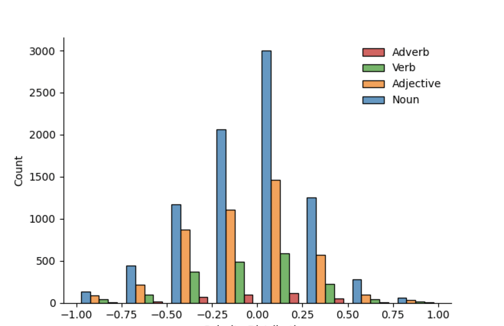

# SRPOL - A lexicon based framework for sentiment strength of Serbian texts

Identifying the semantic orientation or polarity of words is one of the most important topics in sentiment analysis tasks.

In this work, we propose a new lexicon based approach for text polarity detection using sentiment triggers which are adding contextual semantic during the analysis. Lexicon SentiWords.SR is based on the English version lexicon [SentiWords](https://arxiv.org/abs/1510.09079) containing roughly 155.000 English words associated with a sentiment score in the range [-1, 1]. SentiWords.SR contains ~15000 words (e.g. lemma & PoS pairs) which are derived upon extensive evaluation of the translated lexicon.

  


The existing word polarity dictionary in Serbian has been extended containing approximately 15000 words annotated with polarity strength. 


Serbian sentiment framework (SRPOL), relying on the new lexicon and the following sentiment triggers:
### Adverb Modifiers
have a purpose to modify the polarity intensity of an upcoming sentiment-laden word, but not to change its orientation.
  
```math 
\mathit{"\mathbf{Veoma}\ (\rightarrow MOD=1.2)\ \mathbf{dobar}\ (p=+0.43)\ film..." $\xrightarrow[]{1.2 \times (+0.43) }$ +0.52}
```

### Negations
SRPOL considers negations for the upcoming phrase which could include adverb and negation modifiers in addition to the first upcoming standard sentiment-laden word. It identifies negation signals such as the Serbian words `ne`, `ni` or `nije` (eng. 'not') which reverse the score:

```math
\mathit{"Film\ \mathbf{nije}\ ($\rightarrow$ NEG)\ \mathbf{zanimljiv}" (p=+0.53) $\xrightarrow[\times (-1)]{+0.53 }$ -0.53}
```

### Exclamation Marks
exclamation mark increase the perceived sentiment by an average of 6\% for one, and of 18\% for the sequence of more than two exclamation marks.
```math 
\textit{"Odličan film\textbf{!}"($\leftarrow\times$ 1.06)} \xrightarrow[\times 1.06]{p=+0.57}+0.60
```

### Elongated Words
Words that contains a repeating character or group of characters more than two times, emphasizing that word has been identified as sentiment trigger
```math 
\textit{"Tako\ \textbf{dooooosadan} (p=-0.24)..." $\xrightarrow[1.27]{\times 1.05^{chr(o)} }$ "Tako\ \textbf{dosadan}..."(p=-0.30)}
```

### Emoticons and Emojis
Sentiment of emojis has been calculated using the [Emoji Sentiment Ranking v1.0](https://kt.ijs.si/data/Emoji_sentiment_ranking/index.html) lexicon.

```math 
\textit{"Divan (p=+0.4)\ film (p=+0.14)} 
```
😊
 ```math
\textit{(p=+0.678)" $\xrightarrow[]{}$ +0.41}
```


### Text Segmentation
The primary goal of splitting text into segments is to help in improving the polarity scoring for the long text with mixed sentiments detected on the containing segments. SRPOL assess the polarity score for each segment (sentence) of a particular text and using a majority rule approach, predicts sentiment score for the given text:

```math 
P_{text} = \frac{\sum_{i}w_{i} * P_{s}^{i}}{\sum_{i}w_{i}}, i \in [1, S]
```
```math 
w_{i}=\sum_{m}^{S}|sign(P_{s}^{i}) = sign(P_{s}^{m})|
```
```math 
P_{s} = \frac{\sum_{i}P_{w}^{i}}{k}, i \in [1, k], k \in [1, S]
```
### Further Work
- Increase the number of the words in the SentiWords.SR lexicon by using advanced machine learning methods
- Evaluate other possible sentiment triggers
- Evaluate other segmentation techniques and methods for the final score calculation
